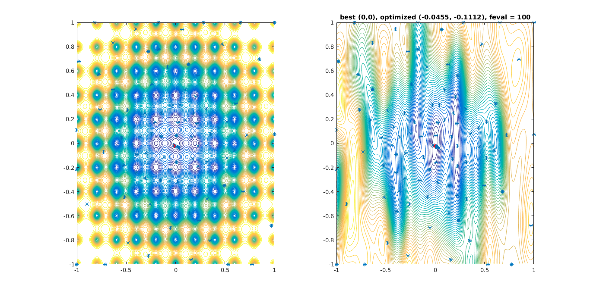

# Outline

- Pandoc template for my weekly report in my research group meeting
- What's in this demo:
    - CJK font: 中文字体
    - Footnote
    - Figures, like @Fig:demoFig
    - Tables, like @Tbl:demoTbl
    - Equations, like @Eq:demoEq
    - Algorithms
    - IEEE style bibliography[@couckuyt2014oodace; @rasmussen2006gaussian; @shahriari2016taking; @gelbart2015constrained; @liu2014gaspad; @melkumyan2011multi]
    - Code

# Use this template:

- Edit meta.yaml for title, author, date
- Edit custom.latex to add custom latex packages
- Edit makefile for markdown file name, target pdf file name, font...
- Edit beamer.tex to modify the beamer template

# 中文字体, footnote

马上相逢揖马鞭，客中相见客中怜。
欲邀击筑悲歌饮，正值倾家无酒钱[^1]。

[^1]: 李白诗一首。

# Figure

Seems that bmp format is not supported.

{#fig:demoFig height=400}

# Table

Language | Good or Bad
---------|------------
Haskell  | Good
C++      | Good
PHP      | Bad

Table: A Table {#tbl:demoTbl}


# Equation

$$
\left\{
\begin{array}{lll}
\mu(\bm{x})      &=& \mu_0(\bm{x}) + \bm{k}(\bm{x})^T(\bm{K} + \sigma^2\bm{I})^{-1}(\bm{y} - \bm{m}) \\
\sigma^2(\bm{x}) &=& k(\bm{x}, \bm{x}) - \bm{k}(\bm{x})^T(\bm{K} + \sigma^2\bm{I})^{-1}\bm{k}(\bm{x}) \\
LCB(\bm{x})      &=& \mu(\bm{x}) - \kappa\sigma(\bm{x})
\end{array}
\right.
$${#eq:demoEq}

# Algorithm

\begin{algorithm}[H]
\caption{Bayesian Optimization}
\label{BayesianOptAlgo}
\begin{algorithmic}[1]
\STATE Initial Sampling
\STATE Construct GP model
\FOR{t = 1, 2, \dots}
\STATE Find $\bm{x}_t$ that minimizes LCB
\STATE Sample $y_t = f(\bm{x}_t) + \epsilon_t$
\STATE Update GP model
\ENDFOR
\RETURN best $f(\bm{x})$ recorded during iterations
\end{algorithmic}
\end{algorithm}

# Code


```cpp
#include <iostream>
using namespace std;
int main()
{
    cout << "Whatever!" << endl;
    return EXIT_SUCCESS;
}
```
