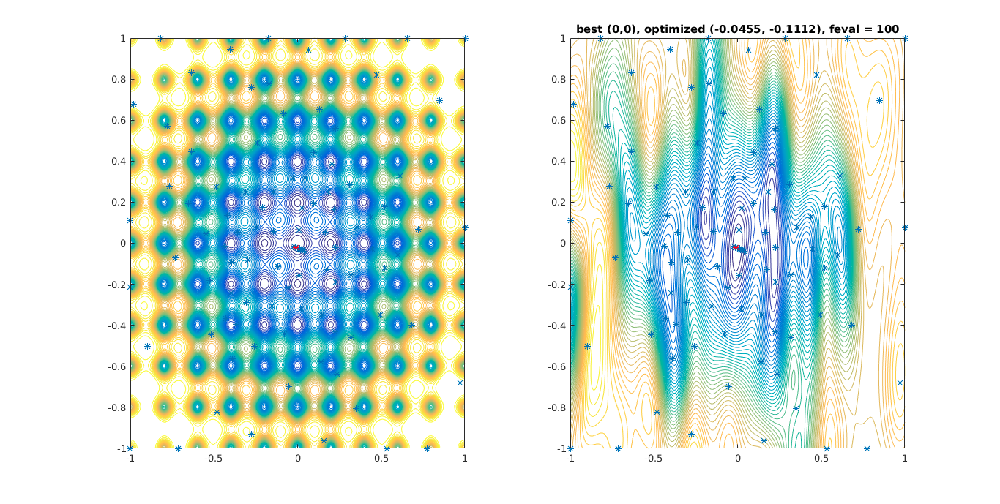

# Outline

- Pandoc template for my weekly report in my research group meeting
- What's in this demo:
    1. Figures, like @Fig:demoFig, Tables, like @Tbl:demoTbl, Equations, like @eq:demoEq
    1. Algorithms
    1. IEEE style bibliography[@couckuyt2014oodace; @rasmussen2006gaussian;
       @shahriari2016taking; @gelbart2015constrained; @liu2014gaspad;
       @melkumyan2011multi]
- See @Sec:SecDEMO

# DEMO{#sec:SecDEMO}

{#fig:demoFig height=400}

Language | Good or Bad
---------|------------
Haskell  | Good
PHP      | Bad

Table: A Table {#tbl:demoTbl}

$$
a^2 + b^2 = c^2
$${#eq:demoEq}

\begin{algorithm}[H]
\caption{Bayesian Optimization}
\label{BayesianOptAlgo}
\begin{algorithmic}[1]
\STATE Initial Sampling
\STATE Construct GP model
\FOR{t = 1, 2, \dots}
\STATE Find $\bm{x}_t$ that minimizes LCB
\STATE Sample $y_t = f(\bm{x}_t) + \epsilon_t$
\STATE Update GP model
\ENDFOR
\RETURN best $f(\bm{x})$ recorded during iterations
\end{algorithmic}
\end{algorithm}
